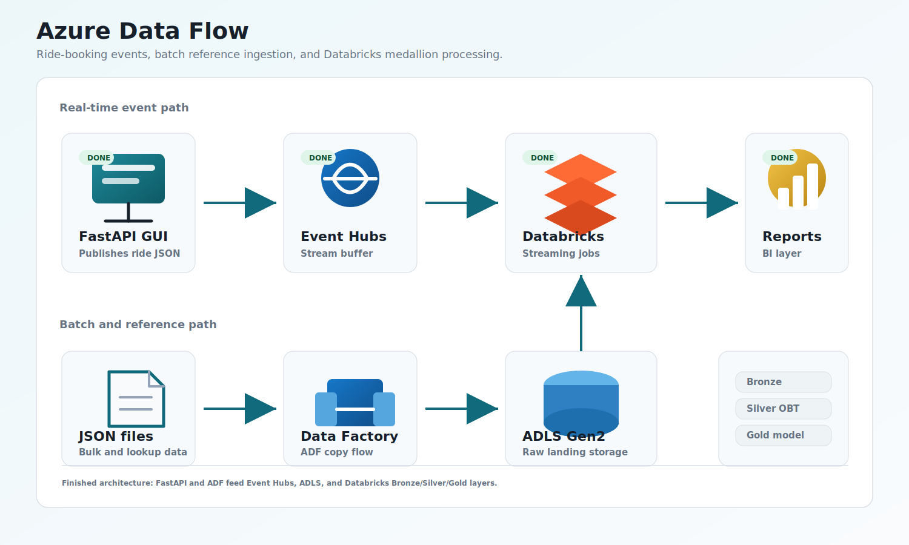
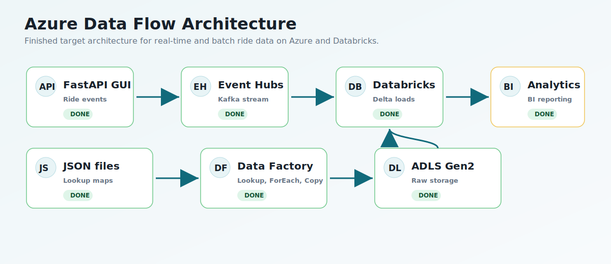
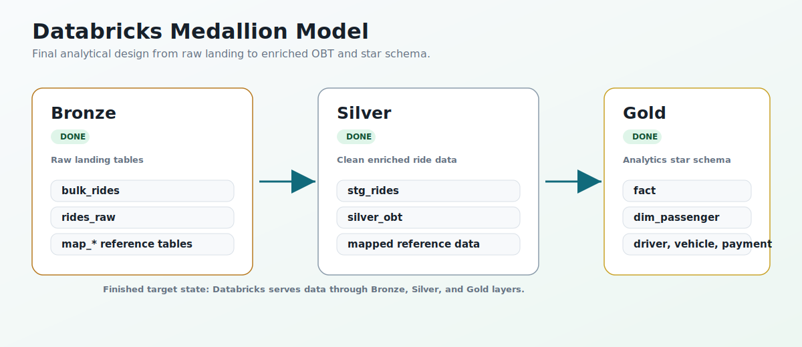

# Azure Data Flow

End-to-end real-time data engineering project on Azure and Databricks using FastAPI, Azure Event Hubs, Azure Data Factory, ADLS Gen2, PySpark streaming, Delta-style medallion modeling, and Terraform.

This project uses a ride-booking scenario. A local FastAPI web application generates synthetic ride confirmation events, sends them to Azure Event Hubs, and feeds an Azure Databricks medallion pipeline.

## Finished Architecture Scope

This README presents the finished target architecture for the portfolio project.

| Area | Result |
| --- | --- |
| Azure infrastructure | Terraform provisions the cloud foundation. |
| FastAPI producer app | The GUI publishes synthetic ride events. |
| Event Hub publishing | Ride events are sent to Azure Event Hubs. |
| ADF batch ingestion | Lookup, ForEach, and Copy load reference files. |
| ADLS Gen2 | Raw JSON files land in data lake storage. |
| Databricks Bronze | Raw and near-raw ride data is loaded. |
| Databricks Silver | Rides are parsed, typed, and enriched into `silver_obt`. |
| Databricks Gold | Fact and dimension tables serve analytics. |
| BI/reporting | The Gold model is ready for dashboarding. |

## Architecture

### Graphical Architecture



Editable diagrams.net source:

```text
architecture/azure-data-flow.drawio
```

Open the `.drawio` file in [diagrams.net](https://app.diagrams.net/) or the Draw.io VS Code extension to edit the architecture visually.

### Pipeline Overview



The finished design has two ingestion paths:

- Real-time ride events: FastAPI GUI -> Azure Event Hubs -> Databricks Structured Streaming.
- Batch/reference data: JSON files -> Azure Data Factory -> ADLS Gen2 -> Databricks Bronze tables.

### Databricks Medallion Model



The medallion design shows the final serving shape: Bronze landing tables, a Silver One Big Table, and Gold fact/dimension tables.

## Screenshots

Screenshots are stored in the `architecture/` folder.

### FastAPI Event Console


### Published Ride Event


### Azure Data Factory Flow


## Technologies

| Category | Tools |
| --- | --- |
| Application | Python, FastAPI, Jinja2, HTML, CSS |
| Streaming | Azure Event Hubs, Kafka-compatible protocol |
| Batch ingestion | Azure Data Factory |
| Storage | Azure Data Lake Storage Gen2 |
| Processing | Azure Databricks, PySpark, Spark Structured Streaming, Spark Declarative Pipelines |
| Modeling | Medallion architecture, Silver OBT, Gold star schema |
| Infrastructure | Terraform, AzureRM provider |
| Local config | `.env`, Python virtual environment |

## Repository Structure

```text
.
|-- api.py                         # FastAPI routes and GUI entry point
|-- connection.py                  # Event Hub producer and .env loading
|-- data.py                        # Synthetic ride-event generator
|-- requirements.txt               # Python dependencies
|-- pyproject.toml                 # Python project metadata
|-- static/
|   `-- styles.css                 # GUI styling
|-- templates/
|   |-- base.html                  # Shared Jinja layout
|   |-- home.html                  # Event publishing console
|   `-- confirmation.html          # Published event receipt
|-- architecture/
|   |-- azure-data-flow-graphical.svg
|   |-- azure-data-flow.drawio       # Editable diagrams.net source
|   |-- pipeline-architecture.svg  # Created architecture diagram
|   |-- medallion-model.svg        # Created medallion diagram
|   |-- API View from browser.png
|   |-- Sent data from browser.png
|   `-- Azure Data factory flow.png
|-- Data/
|   |-- bulk_rides.json
|   |-- map_cancellation_reasons.json
|   |-- map_cities.json
|   |-- map_payment_methods.json
|   |-- map_ride_statuses.json
|   |-- map_vehicle_makes.json
|   `-- map_vehicle_types.json
|-- Code_Files/
|   |-- bronze_adls.ipynb          # Databricks batch/reference loading
|   |-- ingest.py                  # Event Hub streaming ingestion
|   |-- silver.py                  # Staging streaming table
|   |-- silver_obt.sql             # Silver One Big Table SQL
|   |-- silver_obt.ipynb
|   `-- model.py                   # Gold dimensional model script
`-- Terraform/
    |-- main.tf
    |-- providers.tf
    |-- variables.tf
    `-- terraform.tfvars           # Local values; do not commit secrets
```

## Data Sources

### Real-Time Ride Events

The FastAPI application generates one ride confirmation per booking action and sends it to Azure Event Hubs.

Example event shape:

```json
{
  "ride_id": "uuid",
  "confirmation_number": "AB1-2345-CD67",
  "passenger_id": "uuid",
  "driver_id": "uuid",
  "vehicle_id": "uuid",
  "pickup_city_id": 1,
  "dropoff_city_id": 4,
  "booking_timestamp": "2026-04-30T12:00:00",
  "total_fare": 42.75
}
```

The generator also includes driver, vehicle, payment, location, fare, ride status, and cancellation reason fields.

### Batch and Mapping Data

The `Data/` folder contains historical ride data and mapping/reference files:

```text
bulk_rides.json
map_cancellation_reasons.json
map_cities.json
map_payment_methods.json
map_ride_statuses.json
map_vehicle_makes.json
map_vehicle_types.json
```

These files are loaded into Databricks Bronze tables and used to enrich ride events.

## Infrastructure

Terraform defines the Azure resources used by the project:

- Resource Group
- Azure Event Hub Namespace
- Azure Event Hub
- Event Hub send authorization policy
- Event Hub listen authorization policy
- Azure Data Factory
- Azure Storage Account with hierarchical namespace enabled for ADLS Gen2

Run Terraform from the `Terraform/` directory:

```powershell
cd Terraform
terraform init
terraform plan
terraform apply
```

Do not commit Terraform state, `.tfvars`, or local secrets. The project `.gitignore` excludes local Terraform and environment artifacts.

## Local Application

Create and activate a virtual environment:

```powershell
python -m venv .venv
.\.venv\Scripts\Activate.ps1
pip install -r requirements.txt
```

Create a `.env` file in the project root:

```env
CONNECTION_STRING="<event-hub-send-policy-connection-string>"
EVENT_HUBNAME="<event-hub-name>"
```

The app also accepts these aliases:

```text
EVENT_HUB_CONNECTION_STRING
AZURE_EVENT_HUB_CONNECTION_STRING
EVENT_HUB_NAME
EVENTHUB_NAME
AZURE_EVENT_HUB_NAME
```

Run the app:

```powershell
.\.venv\Scripts\python.exe -m uvicorn api:app --host 127.0.0.1 --port 8000 --reload
```

Open:

```text
http://127.0.0.1:8000
```

Use the **Send ride event** button to publish a ride event to Azure Event Hubs.

The app uses `POST /book` for publishing. `GET /book` redirects back to `/` so a browser refresh does not accidentally send duplicate events.

## Databricks Workflow

Databricks assets live in `Code_Files/`.

Recommended execution order:

```text
1. bronze_adls.ipynb
   Load batch and mapping JSON files into Databricks Bronze tables.

2. ingest.py
   Read real-time ride events from Azure Event Hubs using Kafka-compatible options.

3. silver.py
   Build the stg_rides streaming table from bulk rides and streaming rides.

4. silver_obt.sql or silver_obt.ipynb
   Join staged ride data with mapping tables to create silver_obt.

5. model.py
   Build the Gold dimensional model and fact table.
```

Before running `ingest.py`, make sure these constants match your Azure Event Hub:

```python
EVENT_HUB_NAMESPACE = "..."
EVENT_HUB_NAME = "..."
```

The Event Hub connection string is expected from Databricks Spark config:

```python
spark.conf.get("connection_string")
```

## Medallion Design

### Bronze

Bronze stores raw or near-raw data from both ingestion paths.

Expected Bronze tables:

```text
rides_raw
bulk_rides
map_cancellation_reasons
map_cities
map_payment_methods
map_ride_statuses
map_vehicle_makes
map_vehicle_types
```

### Silver

Silver is intended to create a cleaned and enriched One Big Table:

```text
stg_rides -> silver_obt
```

The Silver layer combines:

- Historical rides from `bulk_rides`.
- Streaming rides from `rides_raw`.
- Mapping/reference data.
- Parsed and typed ride payloads.

### Gold

Gold is intended to provide an analytics-ready star schema.

Included model targets:

```text
fact
dim_passenger
dim_driver
dim_vehicle
dim_payment
dim_booking
dim_location
```

`dim_location` is the natural place for SCD Type 2 behavior when location attributes change over time.

## Validation Commands

Run Python syntax checks:

```powershell
.\.venv\Scripts\python.exe -m py_compile api.py connection.py data.py Code_Files\ingest.py Code_Files\silver.py Code_Files\model.py
```

Generate one ride locally:

```powershell
.\.venv\Scripts\python.exe -c "from data import generate_uber_ride_confirmation; import json; print(json.dumps(generate_uber_ride_confirmation(), indent=2))"
```

Send one ride from the command line:

```powershell
.\.venv\Scripts\python.exe connection.py
```

## What Was Learned

This project demonstrates:

- Provisioning Azure data resources with Terraform.
- Building a FastAPI event producer with a real Event Hub send path.
- Using Azure Event Hubs as a Kafka-compatible streaming buffer.
- Building metadata-style ingestion in Azure Data Factory.
- Loading JSON batch/reference data into Azure Databricks.
- Reading Event Hub data with Spark Structured Streaming.
- Designing a medallion architecture for streaming plus batch data.
- Building Silver OBT and Gold star schema assets.

## Future Improvements

Possible improvements:

- Add data quality checks or expectations.
- Add Power BI or another BI dashboard on top of Gold.
- Move secrets to Azure Key Vault or Databricks Secrets.
- Add CI/CD for Terraform and Databricks deployment.
- Add Docker support for the FastAPI producer.
